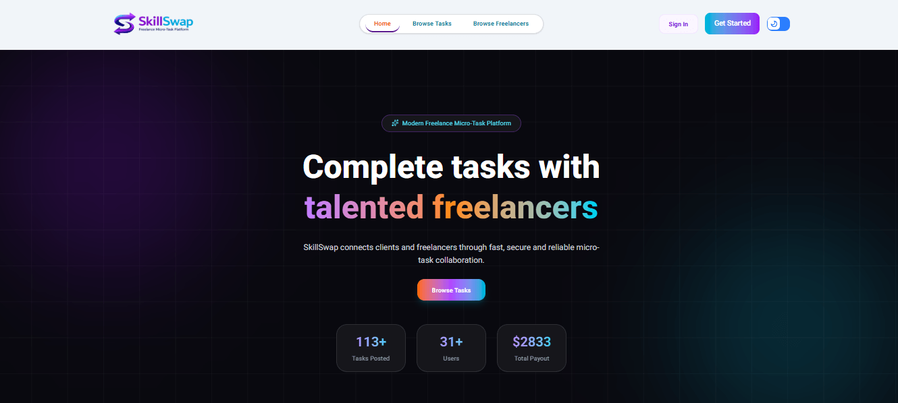

# SkillSwap

SkillSwap is a modern freelancer marketplace platform that connects clients and freelancers in one place. Users can explore skilled professionals, post tasks, manage profiles, and collaborate efficiently. The platform helps clients find the right talent while enabling freelancers to showcase their expertise and receive work opportunities.

## Features

- User authentication and secure login system
- Role-based access (Client & Freelancer)
- Browse and discover freelancers
- Freelancer profile management
- Add skills, bio, and hourly rates
- Task posting and management
- Review and rating system
- Top freelancer showcase
- Responsive design for mobile, tablet, and desktop
- Dynamic data handling with real-time updates

## Technologies Used

### Frontend

- Next.js
- React
- Tailwind CSS
- HeroUI
- Lucide React Icons

### Backend

- Next.js API Routes
- MongoDB
- Server Actions

### Authentication

- Better Auth Authentication

## Main Functionalities

### For Clients

- Create and manage tasks
- Browse freelancer profiles
- View freelancer skills and reviews
- Hire professionals for projects
- Leave reviews and ratings

### For Freelancers

- Create and update profile information
- Add skills and hourly rates
- Showcase expertise
- Receive reviews from clients
- Get discovered by potential clients

## Project Goal

The goal of SkillSwap is to build a user-friendly platform where people can exchange skills and collaborate effectively. It aims to simplify hiring, improve accessibility to skilled professionals, and create opportunities for freelancers.

## Future Improvements

- Real-time messaging system
- Payment integration
- Advanced filtering and search
- Notifications system
- Portfolio upload support

## 📸 Screenshot
  

  
## Live Demo

(https://b13-assignment-10-skillswap-client.vercel.app)

## Repository Client

https://github.com/rashedpine83/B13-Assignment-10-SkillSwap-Client

## Repository Server
https://github.com/rashedpine83/B13-Assignment-10-SkillSwap-server
